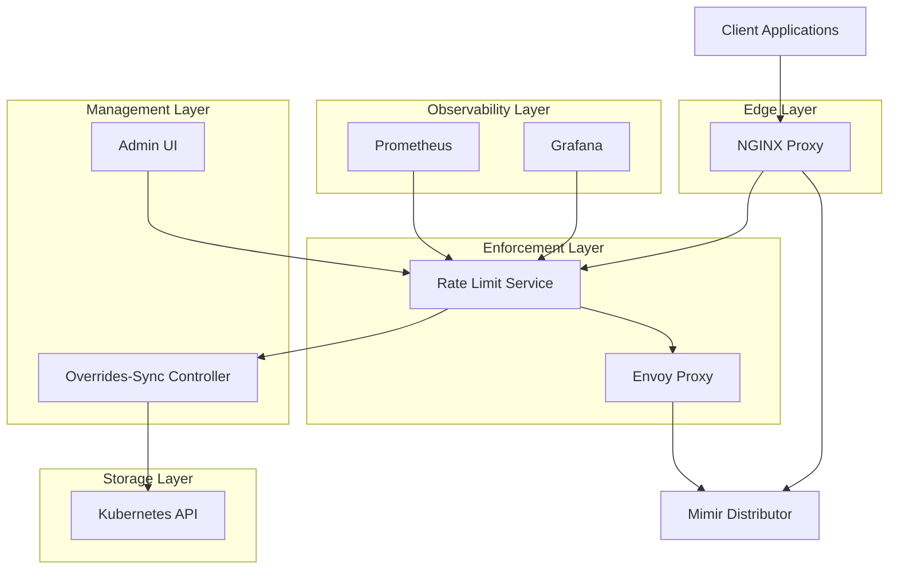
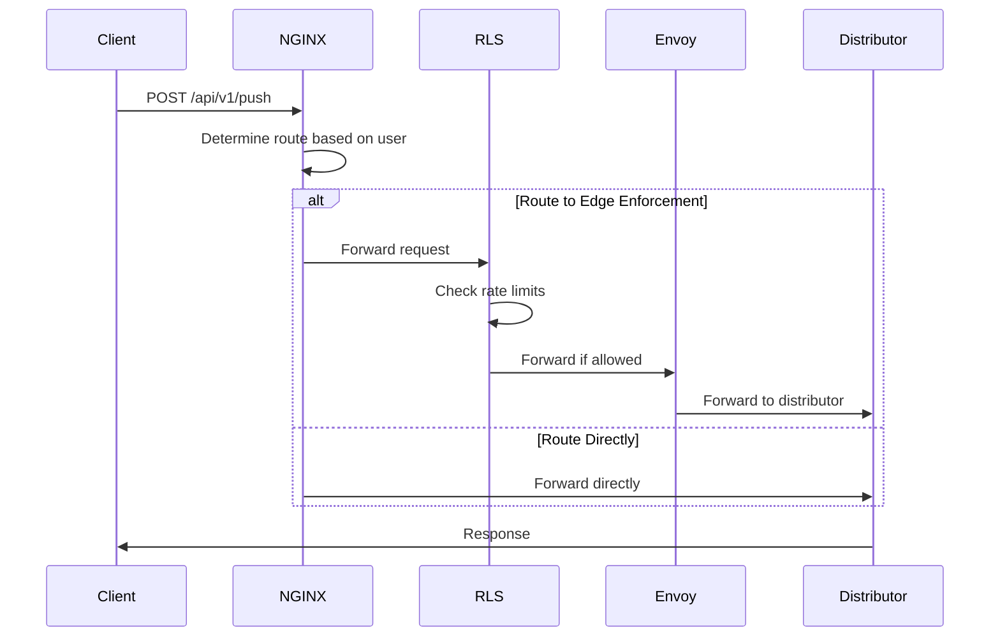
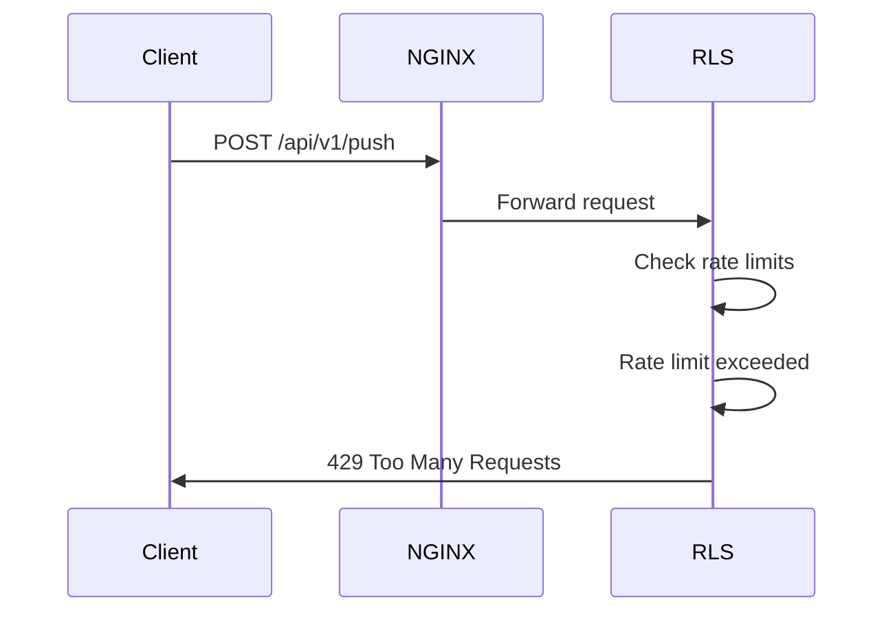
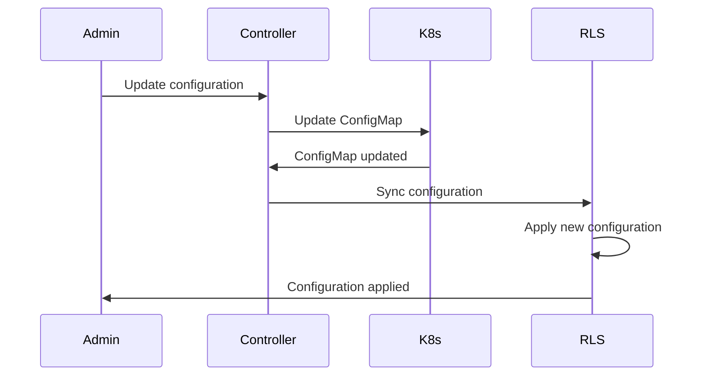
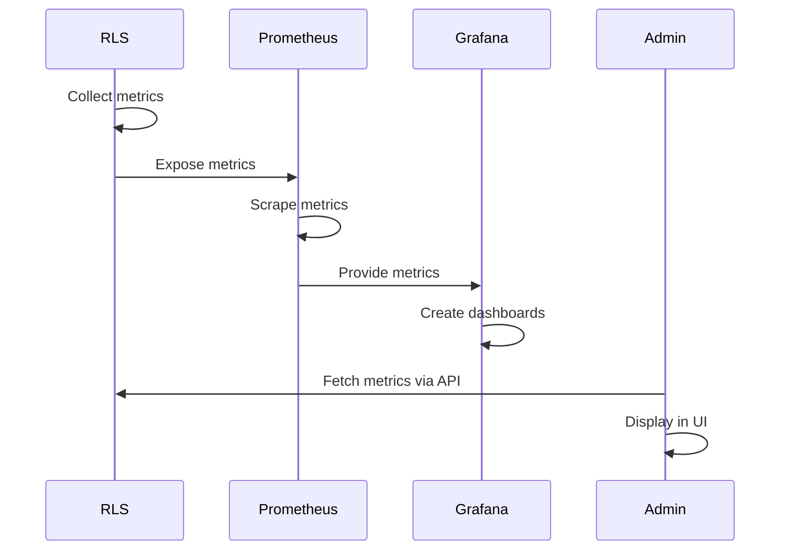

# Component Architecture - Mimir Edge Enforcement

## Overview

This document provides a detailed architectural overview of each component in the Mimir Edge Enforcement system, including their responsibilities, interactions, and design patterns.

## Architecture Overview

### High-Level Component Diagram



## Component Details

### 1. NGINX Proxy (Edge Layer)

#### Purpose
The NGINX proxy serves as the entry point for all incoming traffic and implements selective routing based on user identity.

#### Responsibilities
- **Traffic Routing**: Route traffic based on user identity (`$remote_user`)
- **Load Balancing**: Distribute traffic across backend services
- **SSL Termination**: Handle SSL/TLS termination
- **Request Logging**: Log all requests with routing decisions
- **Health Checking**: Monitor backend service health

#### Architecture
```nginx
# Core Routing Logic
map $remote_user $route_decision {
    "boltx"      "edge";
    "cloudwatch" "edge";
    default      "direct";
}

# Selective Proxy Configuration
location /api/v1/push {
    if ($route_decision = "edge") {
        proxy_pass http://mimir_rls;
        add_header X-Edge-Enforcement "selective";
    }
    if ($route_decision = "direct") {
        proxy_pass http://mimir_direct;
        add_header X-Edge-Enforcement "none";
    }
    add_header X-Route-Decision $route_decision;
}
```

#### Key Features
- **User-based Routing**: Route traffic based on user identity
- **Selective Enforcement**: Apply rate limiting only to specific users
- **Transparent Proxy**: Maintain original request headers and metadata
- **Health Monitoring**: Monitor backend service availability

#### Performance Characteristics
- **Latency**: <1ms routing overhead
- **Throughput**: 100,000+ requests per second
- **Memory**: <100MB per instance
- **CPU**: <5% CPU utilization under normal load

### 2. Rate Limit Service (RLS)

#### Purpose
The Rate Limit Service is the core enforcement engine that implements rate limiting, quota management, and policy enforcement.

#### Responsibilities
- **Rate Limiting**: Implement token bucket rate limiting
- **Quota Management**: Enforce tenant-specific quotas
- **Policy Enforcement**: Apply rate limiting policies
- **Metrics Collection**: Collect and aggregate metrics
- **gRPC Services**: Provide ext_authz and rate limit gRPC APIs

#### Architecture
```go
// Core Service Structure
type RateLimitService struct {
    tenants        map[string]*TenantInfo
    tokenBuckets   map[string]*TokenBucket
    timeAggregator *TimeAggregator
    metrics        *MetricsCollector
    config         *Config
}

// Request Processing Flow
func (rls *RateLimitService) CheckRemoteWriteLimits(tenantID string, body []byte, encoding string) error {
    // 1. Extract tenant information
    tenant := rls.GetOrCreateTenant(tenantID)
    
    // 2. Parse request body
    metrics, err := rls.parseMetrics(body, encoding)
    
    // 3. Check rate limits
    allowed, err := rls.checkRateLimits(tenant, metrics)
    
    // 4. Update metrics
    rls.updateMetrics(tenant, metrics, allowed)
    
    return err
}
```

#### Key Features
- **Token Bucket Algorithm**: Efficient rate limiting with burst support
- **Time-based Aggregation**: Intelligent metric aggregation over time
- **Multi-tenant Support**: Isolated rate limiting per tenant
- **Dynamic Configuration**: Runtime configuration updates
- **Comprehensive Metrics**: Detailed metrics for monitoring and alerting

#### Performance Characteristics
- **Latency**: <5ms for rate limiting decisions
- **Throughput**: 50,000+ requests per second
- **Memory**: <2GB per instance
- **CPU**: <20% CPU utilization under normal load

#### API Endpoints
```yaml
# gRPC Services
grpc_services:
  - name: ext_authz
    port: 8080
    protocol: grpc
    purpose: External authorization decisions
    
  - name: rate_limit
    port: 8081
    protocol: grpc
    purpose: Rate limiting decisions

# HTTP Admin API
http_endpoints:
  - path: /api/tenants
    method: GET
    purpose: List tenants with metrics
    
  - path: /api/overview
    method: GET
    purpose: System overview metrics
    
  - path: /api/health
    method: GET
    purpose: Health check
```

### 3. Envoy Proxy

#### Purpose
Envoy Proxy serves as the internal proxy that handles communication between the RLS and Mimir Distributor, implementing additional rate limiting and load balancing.

#### Responsibilities
- **Internal Routing**: Route requests between RLS and Distributor
- **Rate Limiting**: Apply additional rate limiting filters
- **Load Balancing**: Distribute load across Distributor instances
- **Circuit Breaking**: Implement circuit breakers for fault tolerance
- **Metrics Collection**: Collect proxy-level metrics

#### Architecture
```yaml
# Envoy Configuration
static_resources:
  listeners:
    - name: mimir_listener
      address:
        socket_address:
          address: 0.0.0.0
          port_value: 8080
      filter_chains:
        - filters:
            - name: envoy.filters.network.http_connection_manager
              typed_config:
                "@type": type.googleapis.com/envoy.extensions.filters.network.http_connection_manager.v3.HttpConnectionManager
                stat_prefix: mimir
                route_config:
                  name: mimir_route
                  virtual_hosts:
                    - name: mimir
                      domains: ["*"]
                      routes:
                        - match:
                            prefix: "/"
                          route:
                            cluster: mimir_distributor
                http_filters:
                  - name: envoy.filters.http.ext_authz
                    typed_config:
                      "@type": type.googleapis.com/envoy.extensions.filters.http.ext_authz.v3.ExtAuthz
                      grpc_service:
                        envoy_grpc:
                          cluster_name: rls_service
                  - name: envoy.filters.http.rate_limit
                    typed_config:
                      "@type": type.googleapis.com/envoy.extensions.filters.http.rate_limit.v3.RateLimit
                      domain: mimir
                      rate_limit_service:
                        grpc_service:
                          envoy_grpc:
                            cluster_name: rls_service
```

#### Key Features
- **Ext Authz Integration**: External authorization with RLS
- **Rate Limiting**: Additional rate limiting layer
- **Load Balancing**: Round-robin load balancing
- **Health Checking**: Active health checking
- **Circuit Breaking**: Fault tolerance mechanisms

#### Performance Characteristics
- **Latency**: <2ms proxy overhead
- **Throughput**: 100,000+ requests per second
- **Memory**: <500MB per instance
- **CPU**: <10% CPU utilization under normal load

### 4. Overrides-Sync Controller

#### Purpose
The Overrides-Sync Controller manages the synchronization of rate limiting configurations between Kubernetes ConfigMaps and the RLS service.

#### Responsibilities
- **Config Synchronization**: Sync ConfigMap changes to RLS
- **Dynamic Updates**: Update rate limiting policies without restarts
- **Validation**: Validate configuration changes
- **Rollback**: Support configuration rollbacks
- **Audit Trail**: Maintain configuration change history

#### Architecture
```go
// Controller Structure
type OverridesSyncController struct {
    k8sClient    kubernetes.Interface
    rlsClient    *RLSClient
    configMapWatcher *ConfigMapWatcher
    eventRecorder record.EventRecorder
}

// Configuration Sync Flow
func (c *OverridesSyncController) syncConfigMap(namespace, name string) error {
    // 1. Get ConfigMap from Kubernetes
    configMap, err := c.k8sClient.CoreV1().ConfigMaps(namespace).Get(name, metav1.GetOptions{})
    
    // 2. Parse configuration
    config, err := c.parseConfig(configMap.Data)
    
    // 3. Validate configuration
    if err := c.validateConfig(config); err != nil {
        return err
    }
    
    // 4. Sync to RLS
    return c.rlsClient.UpdateConfig(config)
}
```

#### Key Features
- **Real-time Sync**: Immediate configuration updates
- **Validation**: Comprehensive configuration validation
- **Rollback Support**: Quick rollback to previous configurations
- **Audit Logging**: Complete audit trail of changes
- **Error Handling**: Graceful error handling and recovery

#### Performance Characteristics
- **Sync Latency**: <1 second for configuration updates
- **Memory**: <100MB per instance
- **CPU**: <5% CPU utilization
- **Reliability**: 99.9% configuration sync success rate

### 5. Admin UI

#### Purpose
The Admin UI provides a web-based interface for monitoring, managing, and configuring the Mimir Edge Enforcement system.

#### Responsibilities
- **System Monitoring**: Real-time system metrics and health
- **Tenant Management**: Tenant-specific metrics and configuration
- **Policy Management**: Rate limiting policy configuration
- **Troubleshooting**: Debug and diagnostic tools
- **Reporting**: Generate reports and analytics

#### Architecture
```typescript
// React Component Structure
interface AdminUIProps {
  apiClient: APIClient;
  config: UIConfig;
}

// Main Application Structure
const AdminUI: React.FC<AdminUIProps> = ({ apiClient, config }) => {
  return (
    <Router>
      <Layout>
        <Sidebar />
        <MainContent>
          <Routes>
            <Route path="/" element={<Overview />} />
            <Route path="/tenants" element={<Tenants />} />
            <Route path="/tenants/:id" element={<TenantDetails />} />
            <Route path="/system" element={<SystemHealth />} />
            <Route path="/wiki" element={<Wiki />} />
          </Routes>
        </MainContent>
      </Layout>
    </Router>
  );
};
```

#### Key Features
- **Real-time Updates**: Live metrics and status updates
- **Interactive Dashboards**: Rich, interactive dashboards
- **Responsive Design**: Mobile-friendly interface
- **Search and Filtering**: Advanced search and filtering capabilities
- **Export Functionality**: Export data and reports

#### Performance Characteristics
- **Load Time**: <2 seconds initial load
- **Update Frequency**: 5-second refresh intervals
- **Memory**: <200MB browser memory usage
- **Responsiveness**: <100ms UI interactions

### 6. Mimir Distributor

#### Purpose
The Mimir Distributor is the target service that receives metrics after rate limiting decisions are made.

#### Responsibilities
- **Metrics Ingestion**: Receive and process metrics
- **Data Distribution**: Distribute data to storage backends
- **Validation**: Validate incoming metrics
- **Compression**: Handle compressed metric data
- **Authentication**: Authenticate incoming requests

#### Integration Points
```yaml
# Integration with Edge Enforcement
integration:
  upstream: distributor.mimir.svc.cluster.local:8080
  protocol: HTTP/2
  authentication: Bearer token
  compression: gzip, snappy
  
# Rate Limiting Headers
headers:
  - X-Edge-Enforcement: selective|none
  - X-Route-Decision: edge|direct
  - X-Tenant-ID: <tenant_id>
  - X-Rate-Limited: true|false
```

## Component Interactions

### 1. Request Flow

#### Normal Request Flow


#### Rate Limited Request Flow


### 2. Configuration Flow

#### Dynamic Configuration Update


### 3. Monitoring Flow

#### Metrics Collection


## Design Patterns

### 1. Microservices Architecture

#### Benefits
- **Independent Deployment**: Each component can be deployed independently
- **Technology Diversity**: Different components can use different technologies
- **Scalability**: Components can be scaled independently
- **Fault Isolation**: Failures in one component don't affect others

#### Implementation
```yaml
# Service Independence
services:
  nginx:
    deployment: independent
    scaling: horizontal
    technology: nginx
    
  rls:
    deployment: independent
    scaling: horizontal
    technology: golang
    
  envoy:
    deployment: independent
    scaling: horizontal
    technology: envoy
    
  admin-ui:
    deployment: independent
    scaling: horizontal
    technology: react
```

### 2. Event-Driven Architecture

#### Benefits
- **Loose Coupling**: Components communicate through events
- **Scalability**: Easy to add new event consumers
- **Reliability**: Event persistence and replay capabilities
- **Flexibility**: Dynamic event routing and filtering

#### Implementation
```go
// Event Structure
type Event struct {
    ID        string                 `json:"id"`
    Type      string                 `json:"type"`
    Timestamp time.Time              `json:"timestamp"`
    Data      map[string]interface{} `json:"data"`
    Source    string                 `json:"source"`
}

// Event Types
const (
    EventRateLimitExceeded = "rate_limit_exceeded"
    EventTenantCreated     = "tenant_created"
    EventConfigUpdated     = "config_updated"
    EventHealthCheck       = "health_check"
)
```

### 3. Circuit Breaker Pattern

#### Benefits
- **Fault Tolerance**: Prevent cascading failures
- **Performance**: Fail fast when services are unavailable
- **Recovery**: Automatic recovery when services become available
- **Monitoring**: Clear visibility into service health

#### Implementation
```go
// Circuit Breaker States
type CircuitBreakerState int

const (
    StateClosed CircuitBreakerState = iota
    StateOpen
    StateHalfOpen
)

// Circuit Breaker Implementation
type CircuitBreaker struct {
    state       CircuitBreakerState
    failureCount int
    threshold   int
    timeout     time.Duration
    lastFailure time.Time
    mutex       sync.RWMutex
}
```

### 4. Observer Pattern

#### Benefits
- **Loose Coupling**: Observers don't depend on subject implementation
- **Dynamic Registration**: Observers can be added/removed at runtime
- **Event Broadcasting**: Multiple observers can receive the same event
- **Extensibility**: Easy to add new observers

#### Implementation
```go
// Observer Interface
type Observer interface {
    Update(event Event)
}

// Subject Interface
type Subject interface {
    Attach(observer Observer)
    Detach(observer Observer)
    Notify(event Event)
}

// RLS as Subject
type RateLimitService struct {
    observers []Observer
    mutex     sync.RWMutex
}
```

## Performance Considerations

### 1. Caching Strategy

#### Multi-Level Caching
```yaml
# Cache Levels
caching:
  level_1:
    type: in_memory
    location: process
    size: 100MB
    ttl: 1 minute
    
  level_2:
    type: redis
    location: external
    size: 1GB
    ttl: 10 minutes
    
  level_3:
    type: database
    location: persistent
    size: unlimited
    ttl: 1 hour
```

#### Cache Invalidation
```go
// Cache Invalidation Strategy
type CacheManager struct {
    caches map[string]Cache
    invalidationRules map[string][]InvalidationRule
}

type InvalidationRule struct {
    Pattern string
    TTL     time.Duration
    Priority int
}
```

### 2. Connection Pooling

#### Database Connections
```go
// Connection Pool Configuration
type DBConfig struct {
    MaxOpenConns    int           `yaml:"max_open_conns"`
    MaxIdleConns    int           `yaml:"max_idle_conns"`
    ConnMaxLifetime time.Duration `yaml:"conn_max_lifetime"`
    ConnMaxIdleTime time.Duration `yaml:"conn_max_idle_time"`
}
```

#### HTTP Client Pooling
```go
// HTTP Client Configuration
type HTTPClientConfig struct {
    MaxIdleConns        int           `yaml:"max_idle_conns"`
    MaxIdleConnsPerHost int           `yaml:"max_idle_conns_per_host"`
    IdleConnTimeout     time.Duration `yaml:"idle_conn_timeout"`
    DisableCompression  bool          `yaml:"disable_compression"`
}
```

### 3. Async Processing

#### Background Workers
```go
// Worker Pool
type WorkerPool struct {
    workers    int
    jobQueue   chan Job
    resultChan chan Result
    wg         sync.WaitGroup
}

// Job Processing
func (wp *WorkerPool) Start() {
    for i := 0; i < wp.workers; i++ {
        wp.wg.Add(1)
        go wp.worker()
    }
}
```

## Security Considerations

### 1. Authentication and Authorization

#### Multi-Factor Authentication
```yaml
# Authentication Methods
authentication:
  methods:
    - type: bearer_token
      provider: kubernetes
      
    - type: oauth2
      provider: google
      
    - type: saml
      provider: okta
```

#### Role-Based Access Control
```yaml
# RBAC Configuration
rbac:
  roles:
    - name: admin
      permissions:
        - "*"
        
    - name: operator
      permissions:
        - "read:metrics"
        - "write:config"
        
    - name: viewer
      permissions:
        - "read:metrics"
```

### 2. Data Protection

#### Encryption at Rest
```yaml
# Encryption Configuration
encryption:
  at_rest:
    algorithm: AES-256-GCM
    key_rotation: 90 days
    
  in_transit:
    protocol: TLS 1.3
    cipher_suites:
      - TLS_AES_256_GCM_SHA384
      - TLS_CHACHA20_POLY1305_SHA256
```

#### Data Masking
```go
// Sensitive Data Masking
type DataMasker struct {
    patterns []regexp.Regexp
    masks    map[string]string
}

func (dm *DataMasker) Mask(data []byte) []byte {
    // Implementation for masking sensitive data
}
```

## Conclusion

The Mimir Edge Enforcement system employs a well-architected, microservices-based design that provides:

1. **Scalability**: Each component can be scaled independently
2. **Reliability**: Fault isolation and circuit breaker patterns
3. **Performance**: Optimized for low latency and high throughput
4. **Security**: Comprehensive security measures at all layers
5. **Observability**: Rich monitoring and debugging capabilities

The component architecture ensures that the system can handle the demanding requirements of modern observability environments while maintaining operational simplicity and cost-effectiveness.

---

**Next Steps**:
1. Review deployment strategies in `deployment/deployment-strategy.md`
2. Explore monitoring and observability in `monitoring/monitoring-strategy.md`
3. Understand security architecture in `security/security-architecture.md`
4. Learn about performance characteristics in `performance/performance-characteristics.md`

**Related Documents**:
- [System Architecture](system-architecture.md)
- [Rate Limit Service](../components/rate-limit-service.md)
- [Deployment Strategy](../deployment/deployment-strategy.md)
- [Security Architecture](../security/security-architecture.md)
