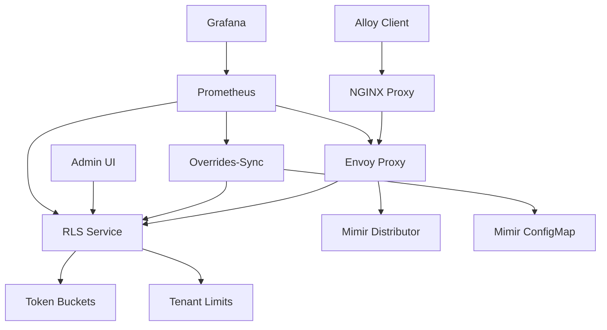
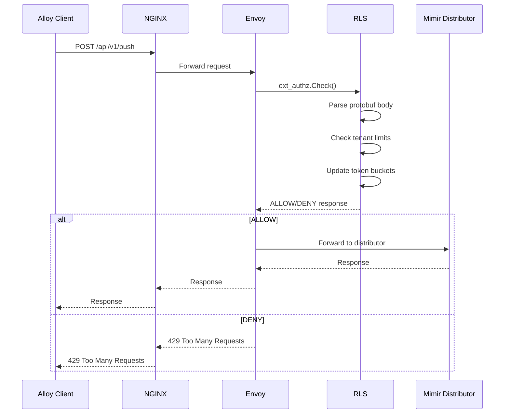
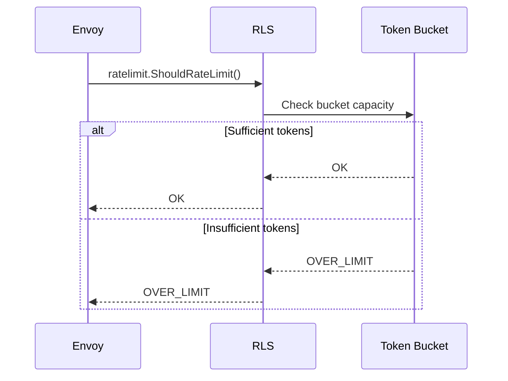
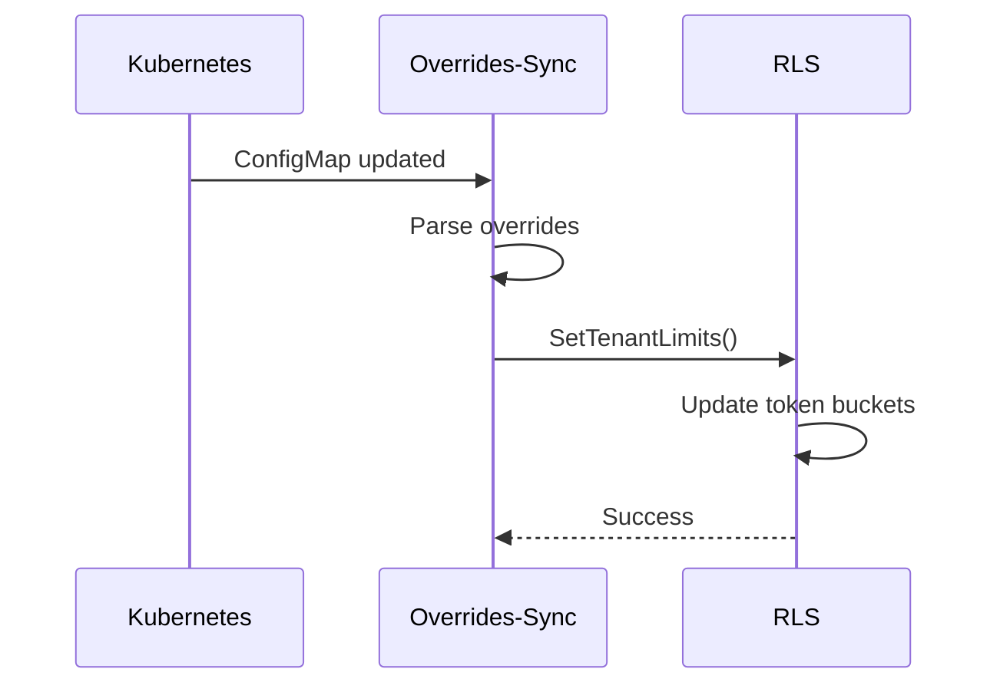

# System Architecture - Mimir Edge Enforcement

## Overview

The Mimir Edge Enforcement system is designed as a modular, cloud-agnostic Kubernetes solution that enforces tenant ingestion limits at the edge with zero client changes and comprehensive observability.

## High-Level System Architecture

### System Components Diagram

```
┌─────────────────────────────────────────────────────────────────────────────────┐
│                              Mimir Edge Enforcement                            │
├─────────────────────────────────────────────────────────────────────────────────┤
│                                                                                 │
│  ┌─────────────┐    ┌─────────────┐    ┌─────────────┐    ┌─────────────┐     │
│  │   Alloy     │───▶│   NGINX     │───▶│   Envoy     │───▶│   Mimir     │     │
│  │  (Client)   │    │  (Proxy)    │    │ (Edge)      │    │Distributor  │     │
│  └─────────────┘    └─────────────┘    └─────────────┘    └─────────────┘     │
│                           │                   │                                │
│                           ▼                   ▼                                │
│                    ┌─────────────┐    ┌─────────────┐                         │
│                    │   RLS       │    │Overrides-   │                         │
│                    │(Auth/Rate)  │    │Sync         │                         │
│                    └─────────────┘    └─────────────┘                         │
│                           │                   │                                │
│                           ▼                   ▼                                │
│                    ┌─────────────┐    ┌─────────────┐                         │
│                    │  Admin UI   │    │   Mimir     │                         │
│                    │  (React)    │    │ Overrides   │                         │
│                    └─────────────┘    │ ConfigMap   │                         │
│                                       └─────────────┘                         │
│                                                                                 │
└─────────────────────────────────────────────────────────────────────────────────┘
```

### Component Interaction Flow



## Detailed Component Architecture

### 1. Client Layer

#### Alloy Client
- **Purpose**: Prometheus remote write client
- **Protocol**: HTTP/HTTPS
- **Authentication**: Bearer token or API key
- **Compression**: gzip, snappy, or uncompressed
- **Batch Size**: Configurable (default: 1MB)

#### NGINX Proxy
- **Purpose**: Load balancer and traffic router
- **Features**:
  - SSL termination
  - Request routing
  - Traffic splitting (mirror/canary)
  - Health checks
  - Rate limiting (coarse)
- **Configuration**: Dynamic reload capability

### 2. Edge Layer

#### Envoy Proxy
- **Purpose**: HTTP proxy with external authorization
- **Filters**:
  - `ext_authz`: External authorization filter
  - `rate_limit`: Rate limiting filter
  - `cors`: Cross-origin resource sharing
  - `compressor`: Response compression
- **Protocols**: HTTP/1.1, HTTP/2, gRPC
- **Clusters**: RLS service clusters

### 3. Enforcement Layer

#### Rate Limit Service (RLS)
- **Purpose**: Core enforcement engine
- **Services**:
  - gRPC ext_authz server
  - gRPC ratelimit server
  - HTTP admin API
- **Features**:
  - Protobuf parsing
  - Token bucket algorithm
  - Time-based aggregation
  - Intelligent caching

### 4. Management Layer

#### Overrides-Sync Controller
- **Purpose**: Kubernetes controller for limit management
- **Features**:
  - ConfigMap watcher
  - Limit parsing
  - RLS synchronization
  - Fallback polling
- **Reconciliation**: Event-driven with polling fallback

#### Admin UI
- **Purpose**: Web-based management interface
- **Technology**: React 18 + TypeScript
- **Features**:
  - Real-time monitoring
  - Tenant management
  - Configuration interface
  - Export capabilities

### 5. Storage Layer

#### In-Memory Storage
- **Purpose**: Primary state storage
- **Data**: Tenant limits, token buckets, metrics
- **Persistence**: Optional Redis backend
- **Scaling**: Horizontal scaling with state sharing

#### Kubernetes Resources
- **ConfigMaps**: Mimir overrides configuration
- **Secrets**: TLS certificates, API keys
- **PersistentVolumes**: Optional Redis storage

## Data Flow Architecture

### 1. Normal Request Flow



### 2. Rate Limiting Flow



### 3. Configuration Sync Flow



## Network Architecture

### Network Topology

```
┌─────────────────────────────────────────────────────────────────────────────────┐
│                              Kubernetes Cluster                                 │
├─────────────────────────────────────────────────────────────────────────────────┤
│                                                                                 │
│  ┌─────────────────────────────────────────────────────────────────────────────┐ │
│  │                              Ingress Layer                                  │ │
│  │  ┌─────────────┐  ┌─────────────┐  ┌─────────────┐  ┌─────────────┐       │ │
│  │  │   NGINX     │  │   NGINX     │  │   NGINX     │  │   NGINX     │       │ │
│  │  │  Ingress    │  │  Ingress    │  │  Ingress    │  │  Ingress    │       │ │
│  │  │ Controller  │  │ Controller  │  │ Controller  │  │ Controller  │       │ │
│  │  └─────────────┘  └─────────────┘  └─────────────┘  └─────────────┘       │ │
│  └─────────────────────────────────────────────────────────────────────────────┘ │
│                                    │                                             │
│  ┌─────────────────────────────────────────────────────────────────────────────┐ │
│  │                              Service Layer                                  │ │
│  │  ┌─────────────┐  ┌─────────────┐  ┌─────────────┐  ┌─────────────┐       │ │
│  │  │   Envoy     │  │   Envoy     │  │   Envoy     │  │   Envoy     │       │ │
│  │  │   Proxy     │  │   Proxy     │  │   Proxy     │  │   Proxy     │       │ │
│  │  └─────────────┘  └─────────────┘  └─────────────┘  └─────────────┘       │ │
│  └─────────────────────────────────────────────────────────────────────────────┘ │
│                                    │                                             │
│  ┌─────────────────────────────────────────────────────────────────────────────┐ │
│  │                            Enforcement Layer                                │ │
│  │  ┌─────────────┐  ┌─────────────┐  ┌─────────────┐  ┌─────────────┐       │ │
│  │  │     RLS     │  │     RLS     │  │     RLS     │  │     RLS     │       │ │
│  │  │   Service   │  │   Service   │  │   Service   │  │   Service   │       │ │
│  │  └─────────────┘  └─────────────┘  └─────────────┘  └─────────────┘       │ │
│  └─────────────────────────────────────────────────────────────────────────────┘ │
│                                    │                                             │
│  ┌─────────────────────────────────────────────────────────────────────────────┐ │
│  │                             Management Layer                                 │ │
│  │  ┌─────────────┐  ┌─────────────┐  ┌─────────────┐  ┌─────────────┐       │ │
│  │  │ Overrides-  │  │   Admin     │  │ Prometheus  │  │   Grafana   │       │ │
│  │  │   Sync      │  │     UI      │  │             │  │             │       │ │
│  │  │ Controller  │  │             │  │             │  │             │       │ │
│  │  └─────────────┘  └─────────────┘  └─────────────┘  └─────────────┘       │ │
│  └─────────────────────────────────────────────────────────────────────────────┘ │
│                                                                                 │
└─────────────────────────────────────────────────────────────────────────────────┘
```

### Network Policies

#### Pod-to-Pod Communication
```yaml
apiVersion: networking.k8s.io/v1
kind: NetworkPolicy
metadata:
  name: mimir-edge-enforcement-network-policy
spec:
  podSelector:
    matchLabels:
      app: mimir-edge-enforcement
  policyTypes:
  - Ingress
  - Egress
  ingress:
  - from:
    - podSelector:
        matchLabels:
          app: nginx-ingress
    ports:
    - protocol: TCP
      port: 8080
  egress:
  - to:
    - podSelector:
        matchLabels:
          app: mimir-distributor
    ports:
    - protocol: TCP
      port: 8080
```

## Security Architecture

### Authentication & Authorization

#### Tenant Identification
- **Method**: HTTP header extraction
- **Default Header**: `X-Scope-OrgID`
- **Configurable**: Custom header support
- **Validation**: Header presence and format

#### Service Authentication
- **gRPC**: mTLS for inter-service communication
- **HTTP**: Bearer tokens for admin API
- **Kubernetes**: Service accounts and RBAC

### Data Protection

#### Request Body Handling
- **Size Limits**: Configurable (default: 50MB)
- **Parsing**: Protobuf parsing with validation
- **Logging**: No sensitive data in logs
- **Storage**: In-memory only, no persistence

#### Metrics & Logging
- **Tenant Context**: Tenant ID in all metrics
- **Privacy**: No sensitive data exposure
- **Retention**: Configurable retention policies
- **Audit**: Complete request audit trail

## Scalability Architecture

### Horizontal Scaling

#### Auto-Scaling Configuration
```yaml
apiVersion: autoscaling/v2
kind: HorizontalPodAutoscaler
metadata:
  name: mimir-rls-hpa
spec:
  scaleTargetRef:
    apiVersion: apps/v1
    kind: Deployment
    name: mimir-rls
  minReplicas: 10
  maxReplicas: 40
  metrics:
  - type: Resource
    resource:
      name: cpu
      target:
        type: Utilization
        averageUtilization: 60
  - type: Resource
    resource:
      name: memory
      target:
        type: Utilization
        averageUtilization: 60
```

#### Load Distribution
- **Algorithm**: Round-robin with health checks
- **Session Affinity**: Optional for stateful operations
- **Health Checks**: Liveness and readiness probes
- **Circuit Breaker**: Automatic failure detection

### State Management

#### In-Memory State
- **Primary**: In-memory storage for performance
- **Scaling**: State sharing across replicas
- **Consistency**: Eventual consistency model
- **Recovery**: Automatic state reconstruction

#### Optional Redis Backend
- **Purpose**: Shared state across replicas
- **Configuration**: Optional for high-scale deployments
- **Fallback**: In-memory if Redis unavailable
- **Performance**: Minimal latency impact

## High Availability

### Multi-Zone Deployment

#### Pod Anti-Affinity
```yaml
spec:
  template:
    spec:
      affinity:
        podAntiAffinity:
          preferredDuringSchedulingIgnoredDuringExecution:
          - weight: 100
            podAffinityTerm:
              labelSelector:
                matchExpressions:
                - key: app
                  operator: In
                  values:
                  - mimir-rls
              topologyKey: kubernetes.io/hostname
```

#### Pod Disruption Budget
```yaml
apiVersion: policy/v1
kind: PodDisruptionBudget
metadata:
  name: mimir-rls-pdb
spec:
  minAvailable: 5
  selector:
    matchLabels:
      app: mimir-rls
```

### Failure Recovery

#### Service Failure Modes
- **ext_authz**: Configurable (allow/deny on failure)
- **ratelimit**: Configurable (allow/deny on failure)
- **RLS Service**: Automatic restart via Kubernetes
- **Envoy Proxy**: Health check failover

#### Data Recovery
- **State Loss**: Automatic reconstruction from ConfigMap
- **Metrics Loss**: Prometheus handles gaps
- **Configuration Loss**: ConfigMap sync restores limits

## Monitoring Architecture

### Metrics Collection

#### Prometheus Integration
- **Scraping**: ServiceMonitor for automatic discovery
- **Metrics**: Custom metrics for all components
- **Labels**: Tenant-aware metric labeling
- **Retention**: Configurable retention policies

#### Custom Metrics
- **RLS Metrics**: Decisions, latency, errors
- **Envoy Metrics**: HTTP stats, filter stats
- **Business Metrics**: Tenant utilization, denials
- **System Metrics**: Resource usage, health status

### Logging Strategy

#### Structured Logging
- **Format**: JSON structured logs
- **Levels**: DEBUG, INFO, WARN, ERROR
- **Context**: Tenant ID, request ID, correlation ID
- **Output**: stdout/stderr for Kubernetes

#### Log Aggregation
- **Collection**: Kubernetes log aggregation
- **Processing**: Optional log processing pipeline
- **Storage**: Centralized log storage
- **Search**: Full-text search capabilities

## Configuration Management

### Dynamic Configuration

#### ConfigMap Integration
- **Source**: Mimir overrides ConfigMap
- **Sync**: Real-time ConfigMap watching
- **Fallback**: Polling when watch fails
- **Validation**: Configuration validation

#### Environment Variables
- **Runtime**: Environment variable configuration
- **Secrets**: Kubernetes secrets for sensitive data
- **Validation**: Configuration validation at startup
- **Documentation**: Comprehensive configuration docs

### Configuration Validation

#### Schema Validation
- **Format**: JSON schema validation
- **Types**: Strong typing for all configurations
- **Defaults**: Sensible defaults for all options
- **Documentation**: Inline configuration documentation

## Integration Points

### External Systems

#### Mimir Integration
- **Protocol**: HTTP/HTTPS
- **Authentication**: Bearer tokens
- **Configuration**: ConfigMap synchronization
- **Monitoring**: Mimir metrics integration

#### Kubernetes Integration
- **Resources**: Native Kubernetes resources
- **RBAC**: Role-based access control
- **Networking**: Network policies and services
- **Storage**: Persistent volumes and secrets

#### Monitoring Integration
- **Prometheus**: Metrics scraping and alerting
- **Grafana**: Dashboard and visualization
- **AlertManager**: Alert routing and notification
- **Logging**: Centralized log aggregation

## Performance Considerations

### Latency Optimization

#### Request Processing
- **Parsing**: Optimized protobuf parsing
- **Validation**: Minimal validation overhead
- **Caching**: Intelligent caching strategies
- **Batching**: Request batching where possible

#### Network Optimization
- **Connection Pooling**: HTTP/2 connection reuse
- **Compression**: Response compression
- **Caching**: Response caching strategies
- **Load Balancing**: Efficient load distribution

### Resource Optimization

#### Memory Management
- **Allocation**: Efficient memory allocation
- **Garbage Collection**: Optimized GC settings
- **Caching**: Memory-efficient caching
- **Monitoring**: Memory usage monitoring

#### CPU Optimization
- **Concurrency**: Efficient concurrency patterns
- **Profiling**: Regular performance profiling
- **Optimization**: Continuous performance optimization
- **Monitoring**: CPU usage monitoring

## Conclusion

The Mimir Edge Enforcement system architecture provides a comprehensive, scalable, and maintainable solution for tenant limit enforcement at the edge. The modular design ensures clear separation of concerns, while the comprehensive monitoring and observability capabilities enable effective operation and troubleshooting.

The architecture supports both current requirements and future growth, with clear upgrade paths and enhancement capabilities. The security-first approach ensures data protection and compliance, while the performance optimizations deliver minimal latency impact.

---

**Next Steps**: Review component-specific architecture documents for detailed implementation details.
