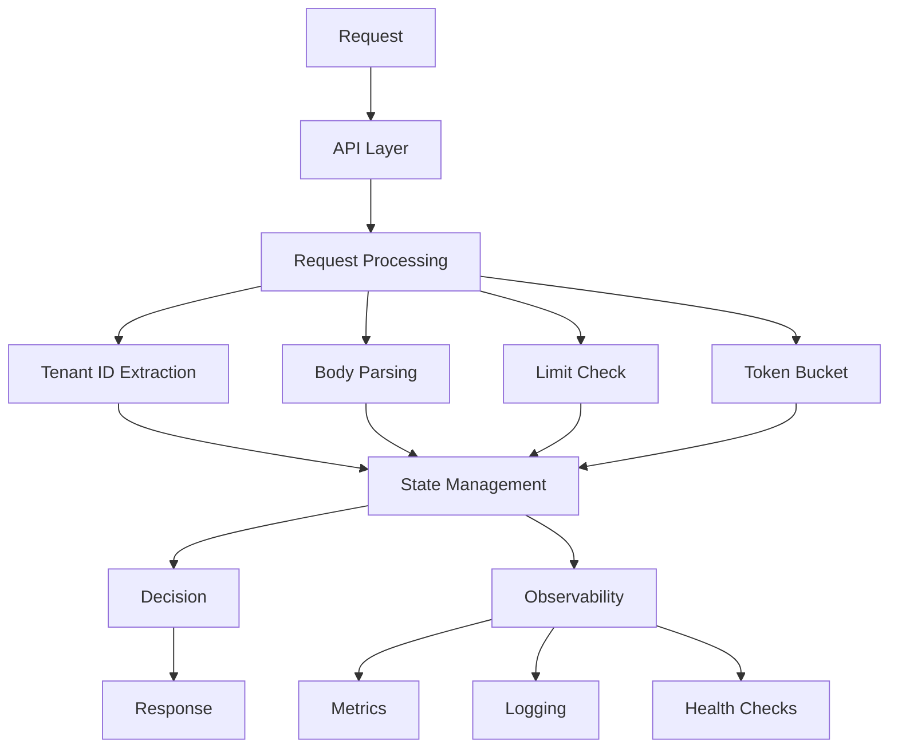

# Rate Limit Service (RLS) - Component Deep Dive

## Overview

The Rate Limit Service (RLS) is the core enforcement engine of the Mimir Edge Enforcement system. It provides authorization and rate limiting decisions through gRPC and HTTP APIs, with comprehensive monitoring and management capabilities.

## Architecture

### Service Architecture Diagram

```
┌─────────────────────────────────────────────────────────────────────────────────┐
│                            Rate Limit Service (RLS)                            │
├─────────────────────────────────────────────────────────────────────────────────┤
│                                                                                 │
│  ┌─────────────────────────────────────────────────────────────────────────────┐ │
│  │                              API Layer                                     │ │
│  │  ┌─────────────┐  ┌─────────────┐  ┌─────────────┐  ┌─────────────┐       │ │
│  │  │   gRPC      │  │   gRPC      │  │   HTTP      │  │   HTTP      │       │ │
│  │  │ ext_authz   │  │ ratelimit   │  │   Admin     │  │   Health    │       │ │
│  │  │   Server    │  │   Server    │  │    API      │  │   Check     │       │ │
│  │  └─────────────┘  └─────────────┘  └─────────────┘  └─────────────┘       │ │
│  └─────────────────────────────────────────────────────────────────────────────┘ │
│                                    │                                             │
│  ┌─────────────────────────────────────────────────────────────────────────────┐ │
│  │                           Request Processing                               │ │
│  │  ┌─────────────┐  ┌─────────────┐  ┌─────────────┐  ┌─────────────┐       │ │
│  │  │   Tenant    │  │   Body      │  │   Limit     │  │   Token     │       │ │
│  │  │     ID      │  │  Parsing    │  │   Check     │  │  Bucket     │       │ │
│  │  │ Extraction  │  │(Protobuf)   │  │             │  │ Algorithm   │       │ │
│  │  └─────────────┘  └─────────────┘  └─────────────┘  └─────────────┘       │ │
│  └─────────────────────────────────────────────────────────────────────────────┘ │
│                                    │                                             │
│  ┌─────────────────────────────────────────────────────────────────────────────┐ │
│  │                            State Management                                │ │
│  │  ┌─────────────┐  ┌─────────────┐  ┌─────────────┐  ┌─────────────┐       │ │
│  │  │   Tenant    │  │   Token     │  │   Time      │  │   Cache     │       │ │
│  │  │   Limits    │  │  Buckets    │  │Aggregator   │  │  System     │       │ │
│  │  │             │  │             │  │             │  │             │       │ │
│  │  └─────────────┘  └─────────────┘  └─────────────┘  └─────────────┘       │ │
│  └─────────────────────────────────────────────────────────────────────────────┘ │
│                                    │                                             │
│  ┌─────────────────────────────────────────────────────────────────────────────┐ │
│  │                            Observability                                   │ │
│  │  ┌─────────────┐  ┌─────────────┐  ┌─────────────┐  ┌─────────────┐       │ │
│  │  │ Prometheus  │  │ Structured  │  │   Health    │  │   Metrics   │       │ │
│  │  │   Metrics   │  │   Logging   │  │   Checks    │  │  Collection │       │ │
│  │  │             │  │             │  │             │  │             │       │ │
│  │  └─────────────┘  └─────────────┘  └─────────────┘  └─────────────┘       │ │
│  └─────────────────────────────────────────────────────────────────────────────┘ │
│                                                                                 │
└─────────────────────────────────────────────────────────────────────────────────┘
```

### Component Interaction Flow



## API Services

### 1. gRPC ext_authz Server

#### Purpose
Provides external authorization decisions for Envoy's ext_authz filter.

#### Protocol
- **Service**: `envoy.service.auth.v3.Authorization`
- **Method**: `Check`
- **Port**: 8081 (default)

#### Request Flow
```go
func (rls *RLS) Check(ctx context.Context, req *envoy_service_auth_v3.CheckRequest) (*envoy_service_auth_v3.CheckResponse, error) {
    // 1. Extract tenant ID from request
    tenantID := rls.extractTenantID(req)
    
    // 2. Parse request body (protobuf)
    body, err := rls.parseRequestBody(req)
    if err != nil {
        return rls.createDenyResponse("body_parse_error"), nil
    }
    
    // 3. Check tenant limits
    decision := rls.checkLimits(tenantID, body)
    
    // 4. Record decision for metrics
    rls.recordDecision(tenantID, decision.Allowed, decision.Reason, body.Samples, body.Bytes, nil, nil, nil)
    
    // 5. Return response
    if decision.Allowed {
        return rls.createAllowResponse(), nil
    }
    return rls.createDenyResponse(decision.Reason), nil
}
```

#### Configuration
```yaml
# Envoy ext_authz filter configuration
http_filters:
- name: envoy.filters.http.ext_authz
  typed_config:
    "@type": type.googleapis.com/envoy.extensions.filters.http.ext_authz.v3.ExtAuthz
    with_request_body:
      max_request_bytes: 52428800  # 50MB
    failure_mode_allow: false
    grpc_service:
      envoy_grpc:
        cluster_name: rls_ext_authz
```

### 2. gRPC ratelimit Server

#### Purpose
Provides rate limiting decisions for Envoy's rate_limit filter.

#### Protocol
- **Service**: `envoy.service.ratelimit.v3.RateLimitService`
- **Method**: `ShouldRateLimit`
- **Port**: 8083 (default)

#### Request Flow
```go
func (rls *RLS) ShouldRateLimit(ctx context.Context, req *envoy_service_ratelimit_v3.RateLimitRequest) (*envoy_service_ratelimit_v3.RateLimitResponse, error) {
    // 1. Extract tenant ID from descriptors
    tenantID := rls.extractTenantIDFromDescriptors(req.Descriptors)
    
    // 2. Check token bucket for rate limiting
    allowed := rls.checkRateLimit(tenantID, req)
    
    // 3. Return rate limit response
    if allowed {
        return &envoy_service_ratelimit_v3.RateLimitResponse{
            OverallCode: envoy_service_ratelimit_v3.RateLimitResponse_OK,
        }, nil
    }
    
    return &envoy_service_ratelimit_v3.RateLimitResponse{
        OverallCode: envoy_service_ratelimit_v3.RateLimitResponse_OVER_LIMIT,
    }, nil
}
```

#### Configuration
```yaml
# Envoy rate_limit filter configuration
http_filters:
- name: envoy.filters.http.ratelimit
  typed_config:
    "@type": type.googleapis.com/envoy.extensions.filters.http.ratelimit.v3.RateLimit
    domain: mimir_remote_write
    rate_limit_service:
      grpc_service:
        envoy_grpc:
          cluster_name: rls_ratelimit
```

### 3. HTTP Admin API

#### Purpose
Provides management and monitoring capabilities through REST API.

#### Endpoints
```bash
# Overview and System Metrics
GET /api/overview?range=1h
GET /api/system/status
GET /api/health

# Tenant Management
GET /api/tenants?range=1h
GET /api/tenants/{id}?range=24h
PUT /api/tenants/{id}/limits
POST /api/tenants/{id}/enforcement

# Denials and Monitoring
GET /api/denials
GET /api/denials/enhanced
GET /api/denials/trends

# Cardinality Management
GET /api/cardinality
GET /api/cardinality/violations
GET /api/cardinality/trends

# Traffic Flow
GET /api/traffic/flow
GET /api/flow/status
GET /api/timeseries/{timeRange}/flow

# Debug and Testing
GET /api/debug/routes
GET /api/debug/tenants
POST /api/debug/add-test-data
```

#### Port Configuration
- **Admin API**: 8082 (default)
- **Metrics**: 9090 (default)
- **Health Check**: 8082/health

## Request Processing

### 1. Tenant ID Extraction

#### Methods
- **HTTP Header**: `X-Scope-OrgID` (default)
- **Configurable**: Custom header support
- **Validation**: Header presence and format

#### Implementation
```go
func (rls *RLS) extractTenantID(req *envoy_service_auth_v3.CheckRequest) string {
    // Extract from HTTP headers
    if req.Attributes.Request.Http != nil {
        for _, header := range req.Attributes.Request.Http.Headers {
            if header.Key == rls.config.TenantHeader {
                return header.Value
            }
        }
    }
    
    // Return default tenant if not found
    return "default"
}
```

### 2. Body Parsing

#### Protobuf Parsing
- **Format**: Prometheus remote write protobuf
- **Compression**: gzip, snappy, uncompressed
- **Validation**: Size limits and format validation

#### Implementation
```go
func (rls *RLS) parseRequestBody(req *envoy_service_auth_v3.CheckRequest) (*RequestInfo, error) {
    // Get request body
    body := req.Attributes.Request.Http.Body
    
    // Check size limits
    if len(body) > rls.config.MaxRequestBytes {
        return nil, fmt.Errorf("request body too large: %d bytes", len(body))
    }
    
    // Parse protobuf
    var writeRequest prompb.WriteRequest
    if err := proto.Unmarshal(body, &writeRequest); err != nil {
        return nil, fmt.Errorf("failed to parse protobuf: %w", err)
    }
    
    // Extract metrics
    info := &RequestInfo{
        Samples: int64(len(writeRequest.Timeseries)),
        Bytes:   int64(len(body)),
    }
    
    // Calculate series and labels
    for _, ts := range writeRequest.Timeseries {
        info.ObservedSeries++
        info.ObservedLabels += int64(len(ts.Labels))
    }
    
    return info, nil
}
```

### 3. Limit Checking

#### Limit Types
- **Samples per Second**: Rate limiting for samples
- **Max Body Bytes**: Request size limits
- **Max Series per Request**: Cardinality limits
- **Max Labels per Series**: Label count limits

#### Implementation
```go
func (rls *RLS) checkLimits(tenantID string, info *RequestInfo) limits.Decision {
    // Get tenant state
    tenant := rls.getTenant(tenantID)
    
    // Check samples per second
    if tenant.Info.Enforcement.EnforceSamplesPerSecond {
        if !tenant.SamplesBucket.Take(float64(info.Samples)) {
            return limits.Decision{
                Allowed: false,
                Reason:  "samples_per_second_exceeded",
                Code:    429,
            }
        }
    }
    
    // Check body size
    if tenant.Info.Enforcement.EnforceMaxBodyBytes {
        if info.Bytes > tenant.Info.Limits.MaxBodyBytes {
            return limits.Decision{
                Allowed: false,
                Reason:  "max_body_bytes_exceeded",
                Code:    413,
            }
        }
    }
    
    // Check series limits
    if tenant.Info.Enforcement.EnforceMaxSeriesPerRequest {
        if info.ObservedSeries > tenant.Info.Limits.MaxSeriesPerRequest {
            return limits.Decision{
                Allowed: false,
                Reason:  "max_series_per_request_exceeded",
                Code:    429,
            }
        }
    }
    
    return limits.Decision{
        Allowed: true,
        Reason:  "allowed",
        Code:    200,
    }
}
```

## State Management

### 1. Tenant Limits

#### Data Structure
```go
type TenantLimits struct {
    SamplesPerSecond    float64 `json:"samples_per_second"`
    MaxBodyBytes        int64   `json:"max_body_bytes"`
    MaxSeriesPerRequest int64   `json:"max_series_per_request"`
    MaxLabelsPerSeries  int64   `json:"max_labels_per_series"`
}

type EnforcementConfig struct {
    Enabled                        bool `json:"enabled"`
    EnforceSamplesPerSecond        bool `json:"enforce_samples_per_second"`
    EnforceMaxBodyBytes            bool `json:"enforce_max_body_bytes"`
    EnforceMaxSeriesPerRequest     bool `json:"enforce_max_series_per_request"`
    EnforceMaxLabelsPerSeries      bool `json:"enforce_max_labels_per_series"`
}
```

#### Storage
- **Primary**: In-memory map
- **Key**: Tenant ID
- **Value**: TenantState with limits and buckets
- **Persistence**: Optional Redis backend

### 2. Token Buckets

#### Algorithm
- **Type**: Token bucket algorithm
- **Refill Rate**: Based on tenant limits
- **Capacity**: Configurable burst capacity
- **Thread Safety**: Concurrent access support

#### Implementation
```go
type TokenBucket struct {
    mu       sync.Mutex
    tokens   float64
    capacity float64
    rate     float64
    lastRefill time.Time
}

func (tb *TokenBucket) Take(tokens float64) bool {
    tb.mu.Lock()
    defer tb.mu.Unlock()
    
    // Refill tokens
    now := time.Now()
    elapsed := now.Sub(tb.lastRefill).Seconds()
    tb.tokens = math.Min(tb.capacity, tb.tokens + elapsed * tb.rate)
    tb.lastRefill = now
    
    // Check if enough tokens
    if tb.tokens >= tokens {
        tb.tokens -= tokens
        return true
    }
    
    return false
}
```

### 3. Time-Based Aggregation

#### Bucket Types
- **15-minute buckets**: Short-term analysis
- **1-hour buckets**: Operational monitoring
- **24-hour buckets**: Daily trends
- **1-week buckets**: Long-term planning

#### Implementation
```go
type TimeBucket struct {
    StartTime         time.Time
    EndTime           time.Time
    TotalRequests     int64
    AllowedRequests   int64
    DeniedRequests    int64
    TotalSeries       int64
    TotalLabels       int64
    Violations        int64
    AvgResponseTime   float64
    MaxResponseTime   float64
    MinResponseTime   float64
    ResponseTimeCount int64
}

type TimeAggregator struct {
    mu sync.RWMutex
    buckets15min map[string]*TimeBucket
    buckets1h    map[string]*TimeBucket
    buckets24h   map[string]*TimeBucket
    buckets1w    map[string]*TimeBucket
}
```

### 4. Caching System

#### Cache Types
- **Overview Cache**: System-wide metrics
- **Tenant Cache**: Per-tenant metrics
- **Configuration Cache**: Tenant limits and settings

#### Implementation
```go
type Cache struct {
    mu    sync.RWMutex
    data  map[string]cacheEntry
    ttl   time.Duration
}

type cacheEntry struct {
    data      interface{}
    timestamp time.Time
    ttl       time.Duration
}

func (c *Cache) Get(key string) (interface{}, bool) {
    c.mu.RLock()
    defer c.mu.RUnlock()
    
    entry, exists := c.data[key]
    if !exists {
        return nil, false
    }
    
    if time.Since(entry.timestamp) > entry.ttl {
        return nil, false
    }
    
    return entry.data, true
}
```

## Observability

### 1. Prometheus Metrics

#### Core Metrics
```promql
# Authorization decisions
rls_decisions_total{decision="allow|deny", tenant="tenant-id", reason="reason"}

# Performance
rls_authz_check_duration_seconds_bucket
rls_body_parse_duration_seconds_bucket

# Errors
rls_body_parse_errors_total
rls_limits_stale_seconds

# Token bucket states
rls_tenant_bucket_tokens{tenant="tenant-id", bucket_type="samples|bytes|requests"}

# Time-based aggregation
rls_time_aggregator_buckets_total{time_range="1h"}
rls_cache_hits_total{cache_type="overview|tenants"}
```

#### Metric Collection
```go
type Metrics struct {
    DecisionsTotal           *prometheus.CounterVec
    AuthzCheckDuration       *prometheus.HistogramVec
    BodyParseDuration        *prometheus.HistogramVec
    BodyParseErrorsTotal     *prometheus.CounterVec
    LimitsStaleSeconds       *prometheus.GaugeVec
    TenantBucketTokens       *prometheus.GaugeVec
    TimeAggregatorBuckets    *prometheus.GaugeVec
    CacheHitsTotal           *prometheus.CounterVec
}
```

### 2. Structured Logging

#### Log Format
```json
{
  "level": "info",
  "time": "2024-01-15T10:30:00Z",
  "tenant": "tenant-1",
  "decision": "deny",
  "reason": "samples_per_second_exceeded",
  "observed_samples": 15000,
  "limit": 10000,
  "request_id": "req-12345",
  "duration_ms": 2.5
}
```

#### Logging Implementation
```go
func (rls *RLS) recordDecision(tenantID string, allowed bool, reason string, samples, bytes int64, requestInfo *limits.RequestInfo, sampleMetrics []limits.SampleMetric, parseInfo *limits.ParseInfo) {
    rls.logger.Info().
        Str("tenant", tenantID).
        Bool("decision", allowed).
        Str("reason", reason).
        Int64("observed_samples", samples).
        Int64("observed_bytes", bytes).
        Interface("request_info", requestInfo).
        Interface("sample_metrics", sampleMetrics).
        Interface("parse_info", parseInfo).
        Msg("RLS decision recorded")
}
```

### 3. Health Checks

#### Health Endpoints
```bash
# Basic health check
GET /api/health

# Detailed health check
GET /api/system/status

# Component health
GET /api/flow/status
```

#### Health Check Implementation
```go
func (rls *RLS) healthCheck(w http.ResponseWriter, r *http.Request) {
    status := map[string]interface{}{
        "status": "healthy",
        "timestamp": time.Now().Format(time.RFC3339),
        "version": rls.version,
        "uptime": time.Since(rls.startTime).String(),
    }
    
    // Check critical components
    if !rls.checkCriticalComponents() {
        status["status"] = "unhealthy"
        w.WriteHeader(http.StatusServiceUnavailable)
    }
    
    writeJSON(w, http.StatusOK, status)
}
```

## Configuration

### 1. Environment Variables

#### Core Configuration
```bash
# Service Configuration
MAX_REQUEST_BYTES=52428800
TENANT_HEADER=X-Scope-OrgID
FAILURE_MODE_ALLOW=false

# Default Limits
DEFAULT_SAMPLES_PER_SECOND=10000
DEFAULT_MAX_BODY_BYTES=52428800
DEFAULT_MAX_SERIES_PER_REQUEST=1000000
DEFAULT_MAX_LABELS_PER_SERIES=30

# Redis Configuration (optional)
REDIS_ADDRESS=redis:6379
REDIS_POOL_SIZE=200
REDIS_MIN_IDLE_CONNS=50

# Logging Configuration
LOG_LEVEL=info
LOG_FORMAT=json
```

### 2. Kubernetes Configuration

#### Deployment Configuration
```yaml
apiVersion: apps/v1
kind: Deployment
metadata:
  name: mimir-rls
spec:
  replicas: 10
  selector:
    matchLabels:
      app: mimir-rls
  template:
    spec:
      containers:
      - name: rls
        image: mimir-rls:latest
        ports:
        - containerPort: 8081  # gRPC ext_authz
        - containerPort: 8082  # HTTP admin
        - containerPort: 8083  # gRPC ratelimit
        - containerPort: 9090  # Metrics
        env:
        - name: MAX_REQUEST_BYTES
          value: "52428800"
        - name: TENANT_HEADER
          value: "X-Scope-OrgID"
        resources:
          requests:
            memory: 8Gi
            cpu: 1000m
          limits:
            memory: 16Gi
            cpu: 4000m
```

## Performance Characteristics

### 1. Latency Impact

#### Request Processing Latency
- **Tenant ID Extraction**: ~0.1ms
- **Body Parsing**: ~0.5-2ms (depending on size)
- **Limit Checking**: ~0.1-1ms
- **Token Bucket Operations**: ~0.1ms
- **Total Overhead**: ~1-5ms per request

#### Optimization Techniques
- **Connection Pooling**: HTTP/2 connection reuse
- **Memory Pooling**: Efficient memory allocation
- **Concurrent Processing**: Goroutine-based request handling
- **Caching**: Intelligent caching strategies

### 2. Throughput

#### Performance Benchmarks
- **Requests per Second**: 10,000+ per instance
- **Concurrent Connections**: 1,000+ per instance
- **Memory Usage**: ~100-500MB per instance
- **CPU Usage**: ~0.1-1 CPU core per instance

#### Scaling Characteristics
- **Horizontal Scaling**: Linear scaling with replicas
- **Load Distribution**: Round-robin with health checks
- **State Sharing**: Optional Redis backend for shared state
- **Auto-scaling**: HPA with CPU/memory targets

### 3. Resource Usage

#### Memory Management
- **In-Memory State**: ~50-200MB per tenant
- **Token Buckets**: ~1KB per tenant
- **Time Aggregator**: ~10-50MB total
- **Cache System**: ~10-100MB total

#### CPU Optimization
- **Goroutine Pool**: Efficient concurrency
- **Lock-Free Operations**: Where possible
- **Batch Processing**: Request batching
- **Profiling**: Regular performance profiling

## Security Considerations

### 1. Authentication & Authorization

#### Service Authentication
- **gRPC**: mTLS for inter-service communication
- **HTTP**: Bearer tokens for admin API
- **Kubernetes**: Service accounts and RBAC

#### Tenant Authentication
- **Header Validation**: Tenant ID header validation
- **Rate Limiting**: Per-tenant rate limiting
- **Access Control**: Tenant isolation

### 2. Data Protection

#### Request Body Handling
- **Size Limits**: Configurable request size limits
- **Parsing Validation**: Protobuf format validation
- **No Persistence**: In-memory only, no disk storage
- **Logging**: No sensitive data in logs

#### Metrics & Logging
- **Tenant Context**: Tenant ID in all metrics
- **Privacy**: No sensitive data exposure
- **Audit Trail**: Complete request audit trail
- **Retention**: Configurable retention policies

## Troubleshooting

### 1. Common Issues

#### High Latency
**Symptoms**: Increased request latency
**Causes**:
- High CPU usage
- Memory pressure
- Network issues
- Token bucket contention

**Solutions**:
```bash
# Check resource usage
kubectl top pods -n mimir-edge-enforcement

# Check metrics
curl http://localhost:9090/metrics | grep rls_authz_check_duration

# Scale up replicas
kubectl scale deployment mimir-rls --replicas=20
```

#### Memory Issues
**Symptoms**: High memory usage or OOM kills
**Causes**:
- Too many tenants
- Large request bodies
- Memory leaks
- Inefficient caching

**Solutions**:
```bash
# Check memory usage
kubectl top pods -n mimir-edge-enforcement

# Check tenant count
curl http://localhost:8082/api/tenants | jq '.tenants | length'

# Increase memory limits
kubectl patch deployment mimir-rls -p '{"spec":{"template":{"spec":{"containers":[{"name":"rls","resources":{"limits":{"memory":"32Gi"}}}]}}}}'
```

### 2. Debug Procedures

#### Enable Debug Logging
```bash
# Update deployment with debug logging
kubectl patch deployment mimir-rls -p '{"spec":{"template":{"spec":{"containers":[{"name":"rls","env":[{"name":"LOG_LEVEL","value":"debug"}]}]}}}}'
```

#### Check Service Health
```bash
# Basic health check
curl http://localhost:8082/api/health

# Detailed status
curl http://localhost:8082/api/system/status

# Component health
curl http://localhost:8082/api/flow/status
```

#### Debug Endpoints
```bash
# List all routes
curl http://localhost:8082/api/debug/routes

# Check tenant state
curl http://localhost:8082/api/debug/tenants

# Add test data
curl -X POST http://localhost:8082/api/debug/add-test-data
```

## Future Enhancements

### 1. Planned Features

#### Advanced Rate Limiting
- **Adaptive Rate Limiting**: Dynamic rate adjustment
- **Burst Handling**: Improved burst capacity management
- **Priority Queuing**: Priority-based request handling
- **Fair Queuing**: Fair resource allocation

#### Enhanced Monitoring
- **Real-time Dashboards**: Live monitoring dashboards
- **Predictive Analytics**: Anomaly detection
- **Custom Alerts**: Tenant-specific alerting
- **Performance Insights**: Detailed performance analysis

### 2. Technical Improvements

#### Performance Optimization
- **Zero-Copy Parsing**: Efficient protobuf parsing
- **Memory Pooling**: Advanced memory management
- **Lock-Free Data Structures**: Improved concurrency
- **Compression**: Response compression

#### Scalability Enhancements
- **Distributed State**: Redis-based state sharing
- **Sharding**: Tenant-based sharding
- **Caching**: Multi-level caching
- **Load Balancing**: Advanced load balancing

## Conclusion

The Rate Limit Service (RLS) is the core enforcement engine of the Mimir Edge Enforcement system, providing comprehensive authorization and rate limiting capabilities. With its modular architecture, comprehensive observability, and production-ready features, it delivers reliable and scalable tenant limit enforcement.

The service's performance characteristics, security features, and troubleshooting capabilities make it suitable for high-scale production environments, while its extensible design supports future enhancements and improvements.

---

**Next Steps**: Review other component documents for integration details and deployment guides.
