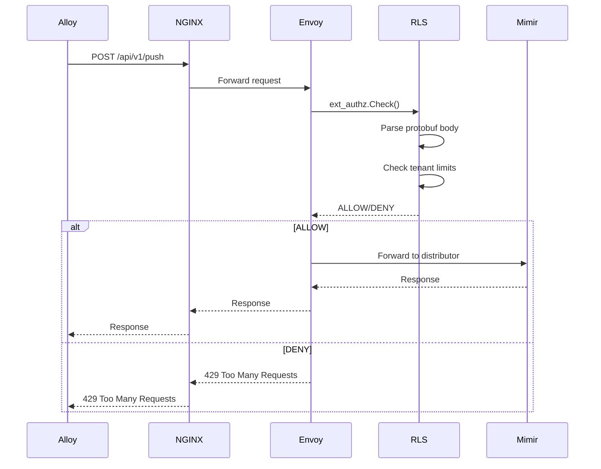
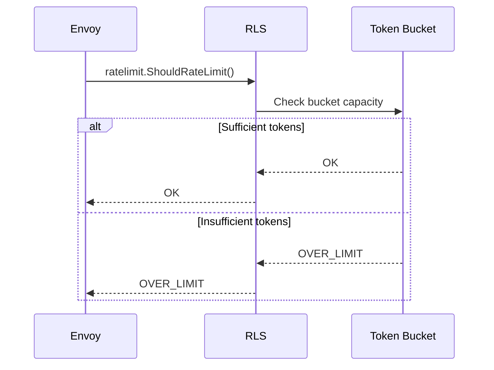
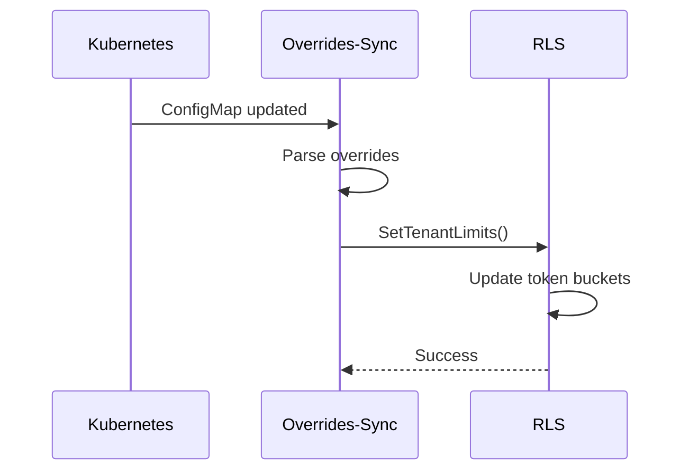

# Mimir Edge Enforcement Architecture

## Overview

Mimir Edge Enforcement is a production-ready, cloud-agnostic Kubernetes solution that enforces Mimir tenant ingestion limits at the edge using Envoy, a Rate/Authorization Service (RLS), an overrides-sync controller, and a React Admin UI.

## High-Level Architecture

```
┌─────────────┐    ┌─────────────┐    ┌─────────────┐    ┌─────────────┐
│   Alloy     │───▶│   NGINX     │───▶│   Envoy     │───▶│   Mimir     │
│  (Client)   │    │  (Proxy)    │    │ (Edge)      │    │Distributor  │
└─────────────┘    └─────────────┘    └─────────────┘    └─────────────┘
                           │                   │
                           ▼                   ▼
                    ┌─────────────┐    ┌─────────────┐
                    │   RLS       │    │Overrides-   │
                    │(Auth/Rate)  │    │Sync         │
                    └─────────────┘    └─────────────┘
                           │                   │
                           ▼                   ▼
                    ┌─────────────┐    ┌─────────────┐
                    │  Admin UI   │    │   Mimir     │
                    │  (React)    │    │ Overrides   │
                    └─────────────┘    │ ConfigMap   │
                                       └─────────────┘
```

## Component Details

### 1. Envoy Proxy

**Purpose**: HTTP proxy with external authorization and rate limiting filters.

**Key Features**:
- **ext_authz filter**: Calls RLS for authorization decisions
- **rate_limit filter**: Calls RLS for rate limiting decisions
- **Request body parsing**: Configurable body size limits
- **Failure modes**: Configurable allow/deny on failures

**Configuration**:
```yaml
# Example Envoy configuration
http_filters:
- name: envoy.filters.http.ext_authz
  typed_config:
    "@type": type.googleapis.com/envoy.extensions.filters.http.ext_authz.v3.ExtAuthz
    with_request_body:
      max_request_bytes: 4194304  # 4 MiB
    failure_mode_allow: false
    grpc_service:
      envoy_grpc:
        cluster_name: rls_ext_authz

- name: envoy.filters.http.ratelimit
  typed_config:
    "@type": type.googleapis.com/envoy.extensions.filters.http.ratelimit.v3.RateLimit
    domain: mimir_remote_write
    rate_limit_service:
      grpc_service:
        envoy_grpc:
          cluster_name: rls_ratelimit
```

### 2. Rate Limit Service (RLS)

**Purpose**: Go service providing authorization and rate limiting logic.

**Key Features**:
- **gRPC ext_authz server**: Authorization decisions
- **gRPC ratelimit server**: Rate limiting decisions
- **HTTP admin API**: Management and monitoring
- **Protobuf parsing**: Remote write request parsing
- **Token bucket algorithm**: Rate limiting implementation

**Architecture**:
```
┌─────────────────────────────────────────────────────────────┐
│                        RLS Service                          │
├─────────────────────────────────────────────────────────────┤
│  gRPC ext_authz  │  gRPC ratelimit  │  HTTP Admin API      │
│     Server       │     Server       │     (Port 8082)      │
├─────────────────────────────────────────────────────────────┤
│                    Request Processing                       │
│  ┌─────────────┐  ┌─────────────┐  ┌─────────────┐        │
│  │ Tenant ID   │  │ Body Parse  │  │ Limit Check │        │
│  │ Extraction  │  │ (Protobuf)  │  │ (Token      │        │
│  └─────────────┘  └─────────────┘  │  Bucket)    │        │
│                                    └─────────────┘        │
├─────────────────────────────────────────────────────────────┤
│                    State Management                         │
│  ┌─────────────┐  ┌─────────────┐  ┌─────────────┐        │
│  │ Tenant      │  │ Token       │  │ Metrics &   │        │
│  │ Limits      │  │ Buckets     │  │ Logging     │        │
│  └─────────────┘  └─────────────┘  └─────────────┘        │
└─────────────────────────────────────────────────────────────┘
```

### 3. Overrides-Sync Controller

**Purpose**: Kubernetes controller that watches Mimir overrides ConfigMap and syncs to RLS.

**Key Features**:
- **ConfigMap watcher**: Watches Mimir overrides ConfigMap
- **Limit parsing**: Parses tenant-specific limits
- **RLS sync**: Updates RLS via gRPC admin API
- **Fallback polling**: Polling when watch fails
- **Metrics**: Exposes sync status metrics

**Data Flow**:
```
┌─────────────────┐    ┌─────────────────┐    ┌─────────────────┐
│   Mimir         │    │ Overrides-Sync  │    │      RLS        │
│ Overrides       │───▶│   Controller    │───▶│   Admin API     │
│ ConfigMap       │    │                 │    │                 │
└─────────────────┘    └─────────────────┘    └─────────────────┘
        │                        │                        │
        │                        ▼                        ▼
        │              ┌─────────────────┐    ┌─────────────────┐
        │              │   Limit Parser  │    │  Tenant State   │
        │              │                 │    │   Update        │
        │              └─────────────────┘    └─────────────────┘
        │                        │                        │
        ▼                        ▼                        ▼
┌─────────────────┐    ┌─────────────────┐    ┌─────────────────┐
│ tenant-1:       │    │ TenantLimits    │    │ Token Buckets   │
│ samples_per_    │    │ struct          │    │ Updated         │
│ second=10000    │    │                 │    │                 │
└─────────────────┘    └─────────────────┘    └─────────────────┘
```

### 4. Admin UI

**Purpose**: React-based web interface for monitoring and management.

**Key Features**:
- **Overview dashboard**: System-wide metrics
- **Tenant management**: Individual tenant monitoring
- **Real-time denials**: Live feed of denied requests
- **System health**: Component status monitoring
- **Export functionality**: CSV export capabilities

## Request Flow

### 1. Normal Request Flow



### 2. Rate Limiting Flow



### 3. Overrides Sync Flow



## Deployment Modes

### 1. Mirror Mode (Phase 1)
- **Purpose**: Zero-impact testing
- **Configuration**: NGINX mirrors traffic to Envoy
- **Impact**: None (mirror responses ignored)
- **Monitoring**: RLS metrics populate

### 2. Canary Mode (Phase 2)
- **Purpose**: Gradual rollout
- **Configuration**: NGINX splits traffic (1% → 100%)
- **Impact**: Limited to canary percentage
- **Monitoring**: Compare canary vs baseline

### 3. Full Mode (Phase 3)
- **Purpose**: Production deployment
- **Configuration**: All traffic through Envoy
- **Impact**: Full enforcement
- **Monitoring**: Complete system metrics

## Security Considerations

### 1. Network Security
- **Network Policies**: Restrict pod-to-pod communication
- **Service Mesh**: Optional integration with Istio/Linkerd
- **TLS**: Encrypt all inter-service communication

### 2. Authentication & Authorization
- **Tenant Identification**: Configurable header (default: X-Scope-OrgID)
- **RBAC**: Minimal Kubernetes permissions
- **Service Accounts**: Non-root containers

### 3. Data Protection
- **Request Body**: Configurable size limits
- **Logging**: Structured logs without sensitive data
- **Metrics**: Tenant-aware but privacy-conscious

## Performance Characteristics

### 1. Latency Impact
- **ext_authz**: ~1-5ms additional latency
- **Body parsing**: ~0.5-2ms for typical requests
- **Rate limiting**: ~0.1-1ms token bucket check

### 2. Throughput
- **RLS**: 10,000+ requests/second per instance
- **Envoy**: 50,000+ requests/second per instance
- **Horizontal scaling**: Auto-scaling based on metrics

### 3. Resource Usage
- **Memory**: ~100-500MB per RLS instance
- **CPU**: ~0.1-1 CPU core per RLS instance
- **Network**: Minimal overhead for control plane

## Failure Modes

### 1. RLS Service Failure
- **ext_authz**: Configurable failure mode (allow/deny)
- **ratelimit**: Configurable failure mode (allow/deny)
- **Recovery**: Automatic restart via Kubernetes

### 2. Envoy Service Failure
- **NGINX fallback**: Direct to Mimir distributor
- **Health checks**: Automatic failover
- **Recovery**: Pod restart and health check passing

### 3. Overrides-Sync Failure
- **Graceful degradation**: RLS continues with last known limits
- **Polling fallback**: Configurable polling interval
- **Recovery**: Controller restart and ConfigMap sync

## Monitoring & Observability

### 1. Metrics
- **RLS**: Decisions, latency, errors, bucket states
- **Envoy**: HTTP metrics, filter stats, upstream health
- **Overrides-Sync**: Sync status, ConfigMap version

### 2. Logging
- **Structured logs**: JSON format for all components
- **Tenant context**: Tenant ID in all log entries
- **Request tracing**: Correlation IDs for debugging

### 3. Dashboards
- **Overview**: System-wide metrics and health
- **Tenant-specific**: Individual tenant performance
- **Operational**: Alerts, errors, and troubleshooting

## Scalability

### 1. Horizontal Scaling
- **RLS**: Multiple replicas with shared state
- **Envoy**: Stateless proxy instances
- **Overrides-Sync**: Single instance (leader election)

### 2. State Management
- **In-memory**: Default for single-instance deployments
- **Redis**: Optional for multi-instance deployments
- **Consistency**: Eventual consistency model

### 3. Load Distribution
- **Kubernetes Services**: Round-robin load balancing
- **Session affinity**: Optional for stateful operations
- **Health checks**: Automatic unhealthy instance removal 